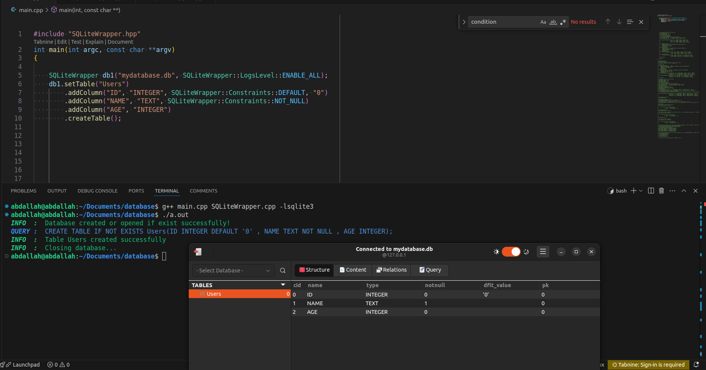
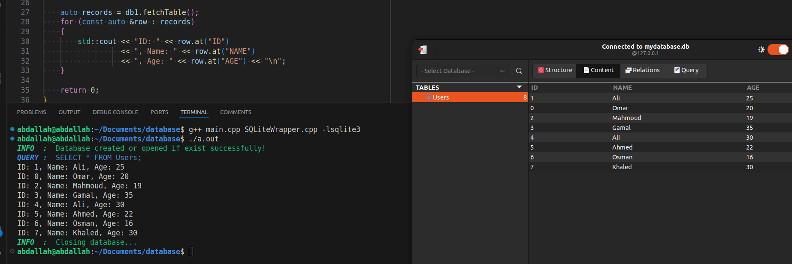
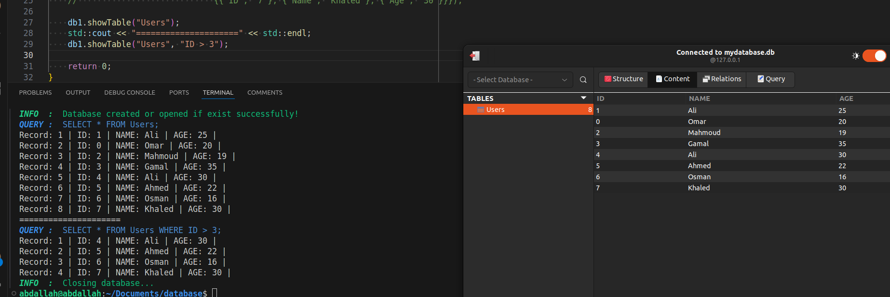
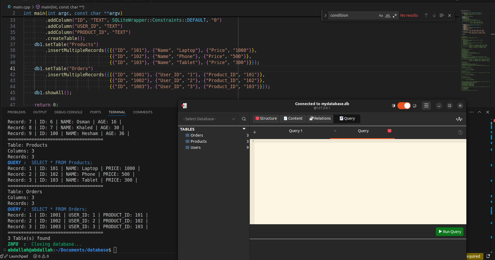

## Project Target

This project is designed for:

1. Individuals with no background in SQL.
2. Developers familiar with SQL but unsure how to integrate it into a C++ application.
3. Those who know SQL and SQLite as a library but find the standard approach too complex.


## Overview

SQLiteWrapper is a lightweight C++ wrapper around SQLite3 that simplifies database operations such as table creation, record insertion, updates, and queries. It provides a clean API for interacting with an SQLite database while ensuring proper resource management and logging.


## Features

- **Database Management:** Open, close, and manage SQLite databases with ease.
- **Table Management:** Create, rename, and delete tables dynamically.
- **Column Management:** Add, rename, and drop columns in existing tables.
- **Data Manipulation:** Insert, update, and delete records efficiently.
- **Query Execution:** Custom SQL queries can be executed directly.
- **Filtering:** Apply filters to fetch data selectively.
- **Logging:** Supports multiple logging levels (INFO, ERROR, QUERY).


## Supported Methods

### **Constructor and Destructor**
```c++
explicit SQLiteWrapper(const std::string &databaseName, LogsLevel logs_level = LogsLevel::DISABLE_ALL);
~SQLiteWrapper();
```

### **Table Management**
```c++
SQLiteWrapper &setTable(const std::string &tableName);
bool createTable();  
void createTable(const std::vector<std::pair<std::string, std::string>> &columns);
bool deleteTable(const std::string &table_name);
bool renameTable(const std::string &oldname, const std::string &newname);
```

### **Column Management**
```c++
SQLiteWrapper &addColumn(const std::string &columnName, const std::string &type, Constraints constraints = Constraints::NO_CONSTRAINTS, const std::string &Default = "", const std::string &Check = "");   
bool renamecolumn(const std::string &table_name, const std::string &column_name, const std::string &new_column_name);   
bool addcolumn(const std::string &table_name, const std::string column_name, const std::string &data_type);   
bool dropcolumn(const std::string &table_name, const std::string column_name);
```
### **Data Manipulation**
```c++

bool insertRecord(const std::map<std::string, std::string> &data);
bool insertValues(const std::vector<std::string> &values);
void insertMultipleRecords(const std::vector<std::map<std::string, std::string>> &records);
bool update_record(const std::string &table_name, const std::string &column_name, const std::string &value, const std::string &condition = "");   
bool removerecord(std::string table_name = "", const std::string &condition = "");
```    

### **Data Display**
```c++
std::vector<std::map<std::string, std::string>> fetchTable();
void showTable(const std::string &table_name, const std::string &condition = "");
void showAll();
```
 

### **Filtering**
```c++
SQLiteWrapper &setFilter(const std::string &column, const std::string &value, const std::string &comparisonoperator);
SQLiteWrapper &disableFilter();
```

### **Logging Management**
```c++ 
void enable_logs(LogsLevel logs_level = LogsLevel::ENABLE_ALL);   
void disable_logs();
```
 
### **Custom Query Execution**
```c++
bool customquery(const std::string &query);
```
## Usage

### **Creating an SQLiteWrapper Instance**

```c++
SQLiteWrapper db("mydatabase.db");
db.enable_logs();
// or you can enable the logs during the creation of the instance (by default it disable)
SQLiteWrapper db1("mydatabase.db", SQLiteWrapper::LogsLevel::ENABLE_ALL);
/* 
there are many levels for logs like :
INFO,
ERROR,
QUERY,
ENABLE_ALL,
DISABLE_ALL
*/
return 0;
}
```


### **Creating a Table**
```c++
db.setTable("Users")
  .addColumn("ID", "TEXT", SQLiteWrapper::Constraints::PRIMARY_KEY)
  .addColumn("Name", "TEXT", SQLiteWrapper::Constraints::NOT_NULL)
  .addColumn("Age", "INTEGER")
  .createTable();
// or you can create table like this
db.setTable("Users");
addColumn("ID", "TEXT", SQLiteWrapper::Constraints::PRIMARY_KEY);
addColumn("Name", "TEXT", SQLiteWrapper::Constraints::NOT_NULL);
addColumn("Age", "INTEGER");
createTable();

/*
the supported Constraints
NO_CONSTRAINTS,
NOT_NULL,
UNIQUE,
PRIMARY_KEY,
CHECK,
DEFAULT,
NOT_NULL_UNIQUE,
NOT_NULL_PRIMARY_KEY,
NOT_NULL_DEFAULT
*/
// in case of using the default or check Constraints you should write the defult value or the check or both
```


### **Inserting Records**
```c++
std::map<std::string, std::string> user = {{"ID", "1"}, {"Name", "Alice"}, {"Age", "25"}};
db.insertRecord(user);
// or you can insert the data direct
db1.insertRecord({{"ID", "1"}, {"Name", "Alice"}, {"Age", "25"}});
// you can insert multiple records
db1.insertMultipleRecords({{{"ID", "2"}, {"Name", "Ali"},{"Age", "30"}},
{{"ID", "3"}, {"Name", "Ahmed"},{"Age", "22"}},
{{"ID", "4"}, {"Name", "Osman"},{"Age", "16"}},
{{"ID", "5"}, {"Name", "Khaled"},{"Age", "30"}}});
```


### **Fetching Data**
```c++
auto records = db.setTable("Users").fetchTable();
for (const auto &row : records)
{
std::cout << "ID: " << row.at("Topic_ID")<< ", Name: " << row.at("TOPIC_PRICE")
<< ", Age: " << row.at("TOPIC_Instructor") << "\n";
}
```


### **Show Table**
```c++
db1.showTable("Users");
db1.showTable("Users", "ID > 3"); // condition
```



### **Updating a Record**

```c++
db1.update_record("Users", "ID", "100", "ID = 20"); // WHERE ID = 20
```


 
### **Show All Tables**
```c++
// Creating the Users table
db1.setTable("Users")
    .addColumn("ID", "TEXT", SQLiteWrapper::Constraints::DEFAULT, "0")
    .addColumn("NAME", "TEXT")
    .addColumn("AGE", "TEXT")
    .createTable();

db1.insertMultipleRecords({{{"ID", "1"}, {"Name", "Ali"}, {"Age", "30"}},
                           {{"ID", "2"}, {"Name", "Ahmed"}, {"Age", "22"}},
                           {{"ID", "3"}, {"Name", "Osman"}, {"Age", "16"}}});

// Creating the Products table
db1.setTable("Products")
    .addColumn("ID", "TEXT", SQLiteWrapper::Constraints::DEFAULT, "0")
    .addColumn("NAME", "TEXT")
    .addColumn("PRICE", "TEXT")
    .createTable();

db1.insertMultipleRecords({{{"ID", "101"}, {"Name", "Laptop"}, {"Price", "1000"}},
                           {{"ID", "102"}, {"Name", "Phone"}, {"Price", "500"}},
                           {{"ID", "103"}, {"Name", "Tablet"}, {"Price", "300"}}});

// Creating the Orders table
db1.setTable("Orders")
    .addColumn("ID", "TEXT", SQLiteWrapper::Constraints::DEFAULT, "0")
    .addColumn("USER_ID", "TEXT")
    .addColumn("PRODUCT_ID", "TEXT")
    .createTable();

db1.insertMultipleRecords({{{"ID", "1001"}, {"User_ID", "1"}, {"Product_ID", "101"}},
                           {{"ID", "1002"}, {"User_ID", "2"}, {"Product_ID", "102"}},
                           {{"ID", "1003"}, {"User_ID", "3"}, {"Product_ID", "103"}}});

db1.showAll();
```





